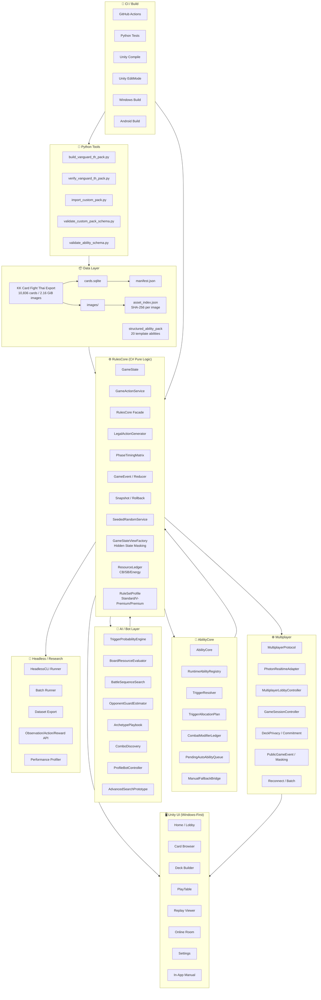
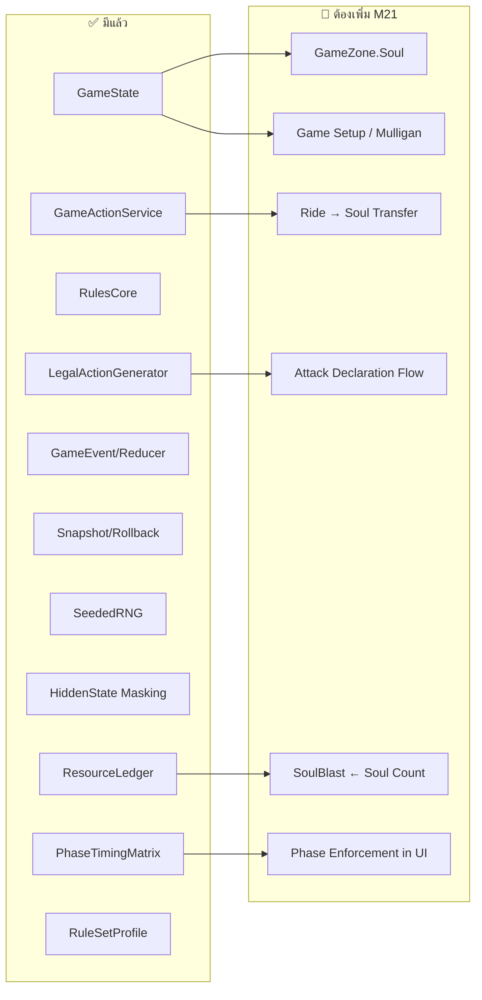
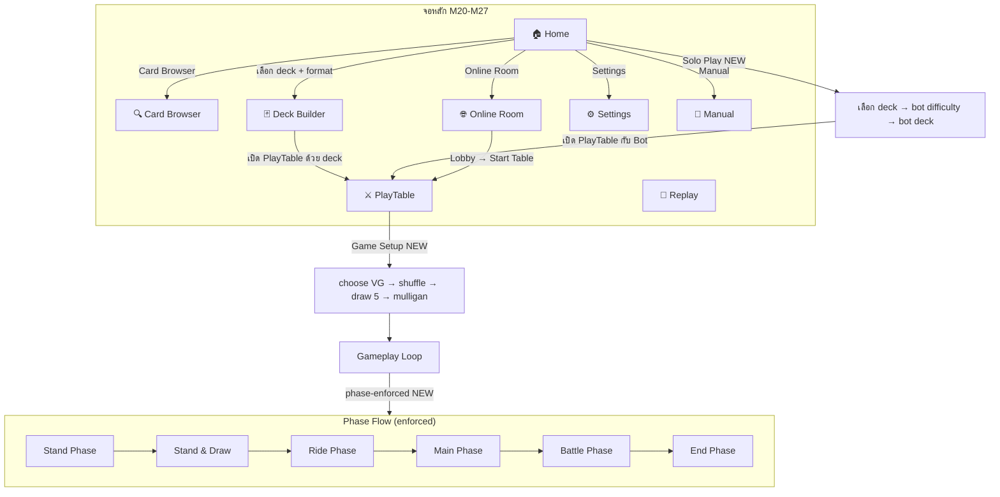
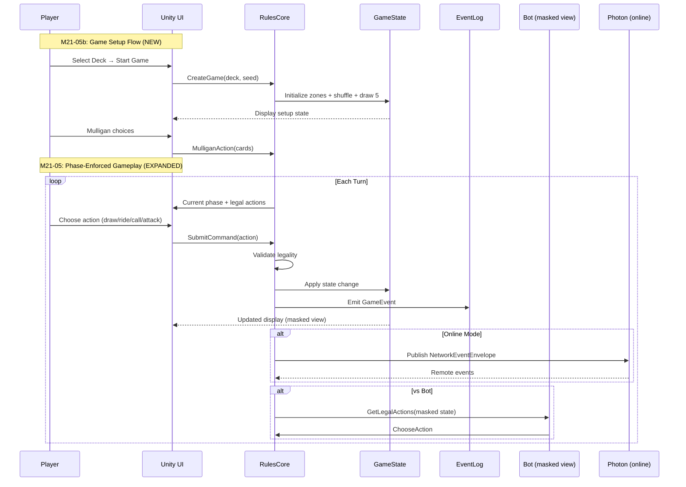

# โครงสร้างระบบหลังปรับแผน M20-M27

## ภาพรวม



---

## Layer-by-Layer

### 1. Data Layer — สิ่งที่มีอยู่แล้ว ✅

| Component | สถานะ | ไฟล์/ตำแหน่ง |
|-----------|--------|-------------|
| Card database (SQLite) | ✅ Done | `data/packs/vanguard_th/cards.sqlite` |
| Manifest | ✅ Done | `data/packs/vanguard_th/manifest.json` |
| Image files (10,836) | ✅ Done | `data/packs/vanguard_th/images/` |
| Asset index (SHA-256) | ✅ Done | `data/packs/vanguard_th/asset_index.json` |
| Structured ability pack | ✅ Done | `data/packs/vanguard_th/abilities/` |
| Custom pack template v1/v2 | ✅ Done | `data/templates/custom_pack[_v2]/` |

---

### 2. RulesCore — สถานะปัจจุบันกับส่วนที่ต้องเพิ่ม



#### รายละเอียด Gap Fix ใน Core

| Gap | Task | ผลกระทบ |
|-----|------|--------|
| **Soul zone ไม่มี** | M21-04b: เพิ่ม `GameZone.Soul` | Ride ต้องส่ง vanguard เดิมเข้า soul, SoulBlast ต้องนับจาก zone จริง |
| **Attack flow ไม่ครบ** | M21-05: wire attack declaration | ต้องมี attacker → target → guard → drive → battle → close |
| **Phase ไม่บังคับ** | M21-05: wire PhaseTimingMatrix | ผู้เล่นต้อง draw ใน Stand & Draw, ride ใน Ride Phase เท่านั้น |
| **Game setup ไม่มี** | M21-05b: guided setup wizard | choose vanguard → shuffle → draw 5 → mulligan → stand up |

---

### 3. Unity UI — สิ่งที่เปลี่ยนหลังปรับแผน



#### PlayTable UI Changes (M21)

| Before (M19) | After (M21+) |
|--------------|-------------|
| Debug-style buttons, all actions always available | Phase-enforced: actions enabled/disabled per phase |
| No card images on board | 🆕 Card thumbnail on circle slots |
| Text-only zone status, `Soul: not modeled` | 🆕 Soul zone count from real data |
| Raw event log | Player-readable: `P1 drew 1 card.` |
| No attack flow | 🆕 Attacker → Target → Guard → Drive → Battle |
| Open table directly | 🆕 Deck selection → Guided game setup → Play |
| No card text in preview | 🆕 Thai skill text in selected-card preview |

---

### 4. Multiplayer — ไม่เปลี่ยน Architecture

```text
สิ่งที่มีอยู่แล้ว (M8-M13):
├─ PhotonRealtimeAdapter (trusted-client)
├─ MultiplayerLobbyController (host/join/ready/start)
├─ MultiplayerGameSessionController (event sync)
├─ DeckPrivacy / Commitment (friend-room only)
├─ PublicGameEvent masking
├─ Reconnect / Batch recovery
├─ SpectatorReplay sync
└─ TournamentAuditLog export

M25 ปรับแค่ UX:
├─ Lobby flow ง่ายขึ้น
├─ Room status ชัดขึ้น
├─ Reconnect UX ดีขึ้น
└─ ซ่อน debug payload จาก default view
```

---

### 5. Bot / AI — ไม่เปลี่ยน Architecture

```text
สิ่งที่มีอยู่แล้ว (M5-M14):
├─ ProfileBotController (Aggro/Balanced/Defensive)
├─ TriggerProbabilityEngine
├─ BoardResourceEvaluator
├─ BattleSequenceSearch
├─ OpponentGuardEstimator
├─ ArchetypePlaybook
├─ ComboDiscovery
└─ AdvancedSearchPrototype (one-ply)

M26 เพิ่ม UX เท่านั้น:
├─ 🆕 Solo Play entry flow จาก Home
├─ 🆕 Bot difficulty selection UI
├─ 🆕 Bot deck selection
└─ Player-readable bot explanation panel
```

---

### 6. Full Component Map

```text
Scripts/Vanguard/
├── Cards/           ← SqliteCardRepository, CardImageCache, CardDefinition
├── Decks/           ← VanguardDeck, DeckValidator, DeckStorage, DeckCodeCodec
├── Game/            ← RulesCore, GameState, GameActionService, LegalAction,
│                       AbilityCore, TriggerResolver, CombatModifier, ResourceLedger,
│                       PhaseTimingMatrix, RuleSetProfile, Snapshot, SeededRNG,
│                       GameStateViewFactory, PendingAutoAbilityQueue, Replay
│                    🆕 GameZone.Soul, AttackDeclarationFlow, GameSetupWizard
├── Bots/            ← ProfileBotController, BattleSequenceSearch, BoardEvaluator,
│                       TriggerProbability, GuardEstimator, Playbook, ComboDiscovery
│                    🆕 SoloPlayEntryFlow
├── Multiplayer/     ← PhotonAdapter, LobbyController, GameSessionController,
│                       DeckPrivacy, PublicGameEvent, Reconnect, TournamentAudit
├── UI/              ← HomeBootstrap, CardBrowserBootstrap, DeckBuilderBootstrap,
│                       PlayTableBootstrap, MultiplayerLobbyBootstrap,
│                       ResponsiveLayoutProfile, UiGameSymbolRegistry
│                    🆕 SettingsScreen, ManualScreen, GameSetupUI, AttackFlowUI,
│                       CardThumbnailOnBoard, PhaseEnforcementUI, DeckSelectDialog,
│                       BotDifficultyDialog
├── Headless/        ← HeadlessCLI, BatchRunner, DatasetExport, ObservationAPI, Profiler
├── Smoke/           ← ClientSmokeFlowRunner, PlayerSmokeBootstrap
│                    🆕 PlayModeIntegrationTest (M27-06)

Assets/Tests/        ← 904 EditMode tests
                     🆕 PlayMode integration tests (M27-06)
```

---

### 7. Data Flow Diagram



---

### 8. สรุป: อะไรเปลี่ยน อะไรไม่เปลี่ยน

| Layer | Architecture เปลี่ยน? | เปลี่ยนอะไร |
|-------|---------------------|------------|
| **Data** | ❌ ไม่เปลี่ยน | — |
| **Python Tools** | ❌ ไม่เปลี่ยน | — |
| **RulesCore** | ⚠️ เพิ่ม component | +Soul zone, +Attack flow, +Game setup, +Phase enforcement in UI |
| **AbilityCore** | ❌ ไม่เปลี่ยน | SoulBlast wire เข้า Soul zone แต่ architecture เดิม |
| **Bot / AI** | ❌ ไม่เปลี่ยน | เพิ่มแค่ UX entry flow |
| **Multiplayer** | ❌ ไม่เปลี่ยน | เพิ่มแค่ UX polish |
| **Unity UI** | ✅ เพิ่ม screens | +Settings, +Manual, +Game Setup, +Attack UI, +Phase UI, +Card-on-board |
| **Headless** | ❌ ไม่เปลี่ยน | — |
| **CI/Build** | ⚠️ เพิ่ม test type | +PlayMode integration test |

> **สรุป**: Architecture หลักไม่เปลี่ยน — ยังคง RulesCore เป็นศูนย์กลาง, UI ส่ง command ผ่าน facade, Bot อ่าน masked view เท่านั้น สิ่งที่เพิ่มคือ **component ที่ขาดใน Core** (Soul, Attack, Setup) และ **หน้าจอ UI ใหม่** (Settings, Manual, Game Setup) ไม่มีการเพิ่ม dependency ใหม่หรือเปลี่ยน stack
